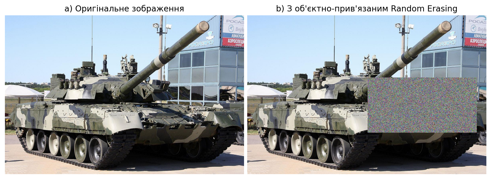
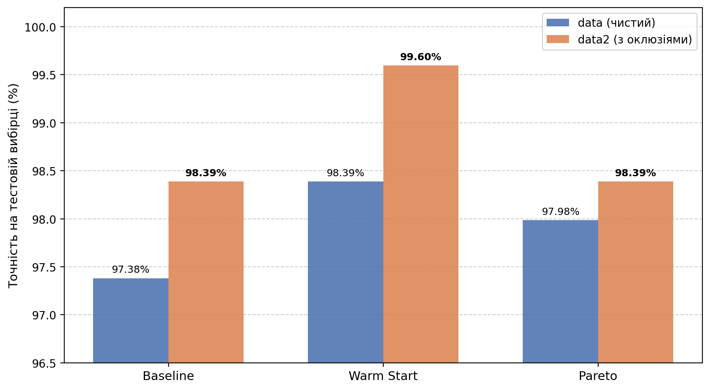
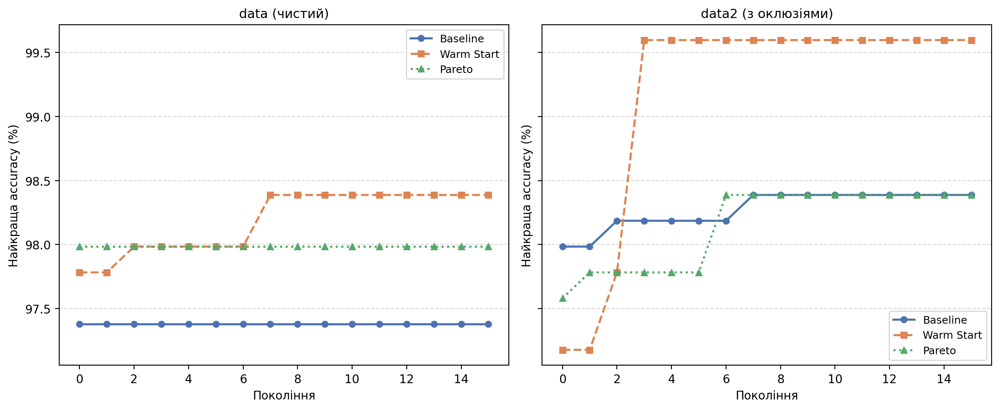

**УДК 004.89:623.4**

# СТРУКТУРНО-ПАРАМЕТРИЧНИЙ СИНТЕЗ ЗГОРТКОВИХ НЕЙРОННИХ МЕРЕЖ ДЛЯ КЛАСИФІКАЦІЇ ЗОБРАЖЕНЬ З БПЛА В УМОВАХ ЧАСТКОВОГО ПЕРЕКРИТТЯ ОБ'ЄКТІВ

**Кот А.Т.,** старший викладач

Кафедра штучного інтелекту, Національний технічний університет України «Київський політехнічний інститут імені Ігоря Сікорського», Київ, Україна

E-mail: anatoly.kot@gmail.com

# STRUCTURAL-PARAMETRIC SYNTHESIS OF CONVOLUTIONAL NEURAL NETWORKS FOR UAV IMAGE CLASSIFICATION UNDER PARTIAL OBJECT OCCLUSION

**A.T. Kot,** Senior Lecturer

Department of Artificial Intelligence, National Technical University of Ukraine "Igor Sikorsky Kyiv Polytechnic Institute", Kyiv, Ukraine

**Анотація.** Об'єкт дослідження - процес автоматичного пошуку оптимальної архітектури згорткових нейронних мереж для класифікації військової техніки на зображеннях з безпілотних літальних апаратів в умовах часткового перекриття об'єктів. Проблематика: на практичних БПЛА-знімках об'єкти часто частково перекриті рослинністю, будівлями або іншими об'єктами, що знижує точність класифікації. Класичні методи пошуку архітектур нейронних мереж оптимізують архітектуру на чистих даних, тому знайдені рішення можуть бути нестійкими до подібних спотворень. Додатковими обмеженнями існуючих методів є надвисокі обчислювальні витрати, відсутність механізмів передачі знань між поколіннями та роздільна оптимізація архітектури і гіперпараметрів. Мета роботи - розробка та порівняльна апробація трьох модифікацій генетичного алгоритму для пошуку архітектур нейронних мереж на чистому та синтетично аугментованому датасеті з імітацією часткового перекриття. Методи дослідження: розроблено розширену хромосому, що кодує архітектуру мережі (включно з depthwise separable convolutions, global average pooling, L2-регуляризацію) та гіперпараметри навчання (optimizer, learning rate, batch size, LR scheduler). Для імітації перекриття сформовано вибірку методом об'єктно-прив'язаного Random Erasing - шумовий прямокутник розміщується всередині bounding box об'єкта. Результати: проведено 6 повних експериментів (3 методи x 2 датасети, pop=12, gen=15, seed=13). Найкращий результат 99.60% досягнуто методом з ламаркіанською еволюцією на аугментованому датасеті. Висновки: ламаркіанська еволюція є найефективнішим методом як на чистих, так і на аугментованих даних; тренування на синтетично перекритих зображеннях виступає ефективним регуляризатором; розширений простір пошуку дозволяє знаходити архітектури, стійкі до просторових спотворень.

**Ключові слова:** пошук архітектури нейронних мереж, генетичний алгоритм, ламаркіанська еволюція, часткове перекриття, random erasing, NSGA-II, depthwise separable convolutions, БПЛА

**Abstract.** The object of research is the process of automatic search for the optimal architecture of convolutional neural networks for classifying military equipment in images from unmanned aerial vehicles under partial object occlusion. The problem: in practical UAV images, objects are often partially occluded by vegetation, buildings, or other objects, which reduces classification accuracy. Classical neural architecture search methods optimize architectures on clean data, so the found solutions may be unstable to such distortions. Additional limitations of existing methods include excessive computational costs, lack of knowledge transfer mechanisms between generations, and separate optimization of architecture and hyperparameters. The aim of the work is to develop and comparatively evaluate three modifications of a genetic algorithm for neural architecture search on clean and synthetically augmented datasets with simulated partial occlusion. Research methods: an extended chromosome is developed that encodes the network architecture (including depthwise separable convolutions, global average pooling, L2-regularization) and training hyperparameters (optimizer, learning rate, batch size, LR scheduler). For occlusion simulation, a dataset was formed using object-targeted Random Erasing - a noise rectangle is placed inside the object's bounding box. Results: 6 full experiments were conducted (3 methods x 2 datasets, pop=12, gen=15, seed=13). The best result of 99.60% was achieved by the method with Lamarckian evolution on the augmented dataset. Conclusions: Lamarckian evolution is the most effective method on both clean and augmented data; training on synthetically occluded images acts as an effective regularizer; the extended search space allows finding architectures robust to spatial distortions.

**Keywords:** neural architecture search, genetic algorithm, Lamarckian evolution, partial occlusion, random erasing, NSGA-II, depthwise separable convolutions, UAV

# 1. Вступ

Автоматизоване розпізнавання військової техніки на зображеннях з безпілотних літальних апаратів є критичною задачею для сучасних систем безпеки та оборони. Точна класифікація об'єктів (танки, літаки, гелікоптери, вантажівки) дозволяє вчасно реагувати на загрози в умовах реального часу. Практичні БПЛА-знімки суттєво відрізняються від лабораторних зображень: окрім геометричних спотворень (перспективні деформації, різна висота зйомки), найпоширенішою проблемою є **часткове перекриття об'єктів** рослинністю, будівлями, іншою технікою або тінями. Ця проблема особливо актуальна в умовах реальних оперативних знімків, де об'єкти рідко перебувають на чистому фоні без перекриттів.

Більшість методів автоматичного пошуку архітектур нейронних мереж (NAS) оптимізуються на чистих тренувальних наборах, що не відображає реальних умов застосування. Архітектура, знайдена на чистих зображеннях, може демонструвати значну деградацію якості при появі оклюзій. NAS, що оптимізується безпосередньо на аугментованих даних з імітованим перекриттям, здатний знаходити архітектури з вбудованою стійкістю до цього типу спотворень.

# 2. Аналіз літературних даних та постановка проблеми

## 2.1. Огляд методів пошуку архітектур нейронних мереж

Сучасні методи NAS поділяються на три групи. **Градієнтні методи** (DARTS [3], ENAS [4]) забезпечують швидкий пошук (0.5-4 GPU-дні) з використанням weight-sharing, але не оптимізують гіперпараметри. **Еволюційні методи** (Genetic CNN [5], AmoebaNet [2]) більш гнучкі, але вимагають від 17 до 3150 GPU-днів. **Гібридні підходи** (NSGA-Net [6], EvNAS [7]) поєднують переваги обох напрямків.

Стійкість до оклюзій у задачах класифікації досліджувалась переважно через data augmentation [8] та механізми уваги [9]. Проте автоматичний пошук архітектур, стійких до оклюзій, з одночасною оптимізацією гіперпараметрів залишається малодослідженою областю.

Порівняльний аналіз методів за ключовими характеристиками наведено у Таблиці 2.1.

**Таблиця 2.1.** Порівняння методів NAS за ключовими характеристиками

| Характеристика | NASNet [1] | DARTS [3] | AmoebaNet [2] | NSGA-Net [6] | Запропонований |
|----------------|-----------|----------|--------------|-------------|----------------|
| Оптимізація гіперпараметрів | Ні | Ні | Ні | Ні | **Так** |
| Ламаркіанська еволюція | Ні | Ні | Ні | Ні | **Так** |
| Багатоцільова оптимізація | Ні | Ні | Ні | Так | **Так** |
| Оптимізація на occluded даних | Ні | Ні | Ні | Ні | **Так** |
| Обчислювальні вимоги (GPU-дні) | 1800 | 4 | 3150 | 27 | **0.3** |

## 2.2. Постановка проблеми та обмеження існуючих підходів

Аналіз методів NAS (Таблиця 2.1) виявляє такі системні обмеження:

- **Надвисокі обчислювальні витрати:** від 0.5 до 3150 GPU-днів (NASNet [1], AmoebaNet [2])
- **Роздільна оптимізація:** архітектура та гіперпараметри оптимізуються незалежно
- **Відсутність передачі знань між поколіннями:** кожна архітектура навчається з нуля - спільний недолік усіх порівнюваних методів
- **Одноцільова оптимізація:** ігнорується компроміс між точністю, розміром моделі та часом навчання
- **Ігнорування оклюзій при оптимізації:** жоден з розглянутих методів не оптимізується на даних з частковим перекриттям

## 2.3. Наукова новизна

**1. Метод об'єктно-прив'язаного Random Erasing для формування вибірки з оклюзіями.**

Запропоновано спосіб формування синтетичної вибірки з імітованим перекриттям, де шумовий прямокутник розміщується всередині union bounding box усіх об'єктів зображення на основі XML-анотацій. На відміну від глобального Random Erasing [9], це гарантує, що спотворення торкається саме об'єкта класифікації, а не фону.

**2. Розширений простір пошуку хромосоми для задач з оклюзіями.**

Хромосома розширена новими елементами: depthwise separable convolutions (менша кількість параметрів, краща узагальнювальна здатність), global average pooling (стійкіший до просторових зсувів), L2-регуляризація шарів (ваги з {0, 10^(-4), 10^(-3)}), LR scheduler як еволюційний ген (none / step / cosine).

**3. Порівняльне дослідження трьох методів NAS в умовах оклюзій.**

Перше систематичне порівняння baseline GA, ламаркіанського GA та NSGA-II Pareto GA на однаковому датасеті у двох варіантах (чистий / з оклюзіями).

# 3. Мета та задачі дослідження

**Мета:** порівняльна апробація трьох методів GA-NAS (базовий, з ламаркіанською еволюцією, з Pareto-оптимізацією NSGA-II) на чистому та синтетично аугментованому датасеті з метою виявлення архітектур, стійких до часткового перекриття об'єктів на БПЛА-знімках.

**Задачі:**

1. Розробити метод формування аугментованої вибірки з об'єктно-прив'язаним Random Erasing
2. Розширити простір пошуку хромосоми: depthwise separable convolutions, global average pooling, L2-регуляризація, LR scheduler
3. Реалізувати три методи NAS: baseline GA, GA з ламаркіанською еволюцією, GA з NSGA-II
4. Провести 6 повних порівняльних експериментів (3 методи x 2 датасети)
5. Проаналізувати вплив оклюзії на знайдені архітектури та ефективність методів пошуку

# 4. Матеріали та методи досліджень

## 4.1. Датасети

### 4.1.1. Базовий датасет (data)

Для апробації методу обрано датасет Military and Civilian Vehicles Classification (Kaggle), що містить зображення військової та цивільної техніки. Характеристики: 6702 тренувальних та 496 тестових зображень, 6 класів (цивільний літак, цивільний автомобіль, військовий літак, військовий гелікоптер, військовий танк, військова вантажівка). Зображення розміром 64x64 пікселі (RGB). Розподіл класів у тренувальній вибірці наведено у Таблиці 4.1.

**Таблиця 4.1.** Розподіл класів у тренувальній вибірці

| Клас | Кількість зображень | Частка |
|------|---------------------|--------|
| Цивільний літак | 956 | 14.3% |
| Цивільний автомобіль | 1032 | 15.4% |
| Військовий літак | 971 | 14.5% |
| Військовий гелікоптер | 1173 | 17.5% |
| Військовий танк | 1619 | 24.2% |
| Військова вантажівка | 951 | 14.2% |

Попередня обробка: нормалізація пікселів [0, 255] до [0, 1], зміна розміру до 64x64 для оптимізації використання GPU.

### 4.1.2. Аугментована вибірка з оклюзіями (data2)

Для імітації часткового перекриття об'єктів сформовано вибірку data2 методом **об'єктно-прив'язаного Random Erasing** [9]. Алгоритм формування:

1. Для кожного зображення завантажується XML-анотація у форматі Pascal VOC з bounding boxes усіх об'єктів
2. Обчислюється union bounding box (об'єднання всіх bounding boxes)
3. Всередині union bounding box розміщується один прямокутник з пікселями випадкового шуму (рівномірний розподіл [0, 255] по кожному каналу RGB)
4. Параметри прямокутника: площа 20-40% від площі bounding box, aspect ratio від 0.3 до 3.3
5. Зображення зберігається з тим самим іменем файлу та незмінними мітками класів

З 6772 зображень датасету: 6702 оброблено з об'єктно-прив'язаним розміщенням (XML-анотації знайдено), 70 - з глобальним розміщенням (fallback при відсутності XML). Час генерації: ~52 секунди (CPU). Приклад результату аугментації наведено на Рисунку 4.1.

## 4.2. Кодування хромосоми

Хромосома кодує повну специфікацію нейронної мережі і складається з двох частин: структурної (архітектура мережі) та параметричної (гіперпараметри навчання).

### 4.2.1. Базове кодування

Структурна частина задає змінну за довжиною послідовність шарів від 3 до 6 (не враховуючи вихідний Dense). Базовий набір підтримуваних типів наведено у Таблиці 4.2: Conv2D (filters з {32,64,128}, kernel з {3,5}), BatchNorm, MaxPool (pool_size=2), Flatten, Dense (neurons з {64,128,256}) та Dropout (rate від 0.2 до 0.5). Перший шар завжди Conv2D; останній - Dense(6, softmax). Параметрична частина містить три гени: learning rate (з [0.0001, 0.001]), batch size (з {16, 32}) та optimizer (з {Adam, SGD, RMSprop}).

**Таблиця 4.2.** Базовий набір типів шарів

| Тип шару | Параметри | Призначення |
|----------|-----------|-------------|
| Conv2D | filters в {32,64,128}, kernel в {3,5} | Виділення просторових ознак |
| BatchNorm | - | Нормалізація активацій |
| MaxPool | pool_size = 2 | Зменшення розмірності |
| Flatten | - | Перетворення 2D до 1D |
| Dense | neurons в {64,128,256} | Класифікатор |
| Dropout | rate від 0.2 до 0.5 | Регуляризація |

### 4.2.2. Розширення простору пошуку для задач з оклюзіями

Базове кодування розширено чотирма новими елементами. Повний розширений набір наведено у Таблиці 4.3.

**Таблиця 4.3.** Розширений набір типів шарів (нові елементи позначено *)

| Тип шару | Параметри | Призначення |
|----------|-----------|-------------|
| Conv2D | filters в {32,64,128}, kernel в {3,5}, l2_reg* | Виділення просторових ознак |
| DepthwiseConv* | filters в {32,64,128}, kernel в {3,5}, l2_reg* | Легший аналог Conv2D: менше параметрів |
| BatchNorm | - | Нормалізація активацій |
| MaxPool | pool_size = 2 | Зменшення розмірності |
| Flatten | - | Перетворення 2D до 1D |
| GlobalAvgPool* | - | Альтернатива Flatten: стійкіша до просторових зсувів |
| Dense | neurons в {32,64,128,256}, l2_reg* | Класифікатор |
| Dropout | rate від 0.2 до 0.5 | Регуляризація |

Параметр `l2_reg` додано до Conv2D, DepthwiseConv та Dense: значення з {0, 0.0001, 0.001}. До параметричної частини хромосоми додано ген **LR scheduler** з {none, step, cosine}: при `step` застосовується ReduceLROnPlateau (factor=0.5, patience=5); при `cosine` - CosineDecay. Scheduler успадковується при кросовері та підлягає мутації. При структурній мутації або кросовері, що порушує правила валідності, система повторює спроби до 20 разів.

## 4.3. Функція пристосованості

Функція пристосованості визначається як максимальна точність класифікації на валідаційному наборі за весь процес тренування:

$$
f(c) = \max_{i=1}^{n} \text{acc}_{\text{val}}^{(i)}, \qquad (1)
$$

де $c$ - хромосома, $\text{acc}_{\text{val}}^{(i)}$ - точність після $i$-ої епохи, $n$ - кількість епох. Використання максимуму, а не фінального значення в (1), захищає від оцінки перенавчаних моделей. EarlyStopping (patience=3, min_delta=0.001) обмежує тривалість тренування та відновлює ваги найкращої епохи.

## 4.4. Генетичні оператори

**Турнірна селекція** ($k=2$): вибирається найкраща особина з випадкової пари.

**Гібридний кросовер** ($P_c=0.7$): структурний одноточковий кросовер (обмін сегментами шарів) та параметричний (averaging learning rate, random choice для batch size, optimizer, lr_scheduler). При невалідності результату кросовера - заміна на копію кращого батька.

**Адаптивна мутація** ($P_m=0.4$): структурна (add/remove/modify шар) або параметрична (зміна lr, batch, optimizer, lr_scheduler). При невалідності структурної мутації - до 20 повторних спроб.

**Елітизм** (elite_size=1): найкраща особина переходить у наступне покоління незмінною.

## 4.5. Три методи NAS

### 4.5.1. Baseline GA

Стандартний генетичний алгоритм без додаткових механізмів. Кожна нова архітектура навчається з нуля (випадкова ініціалізація ваг). Служить базовою лінією для порівняння.

### 4.5.2. GA з ламаркіанським теплим стартом (Warm Start)

Метод базується на ідеях ламаркіанської еволюції [10]: нащадок успадковує навчені ваги від батька з найдовшою спільною префіксною послідовністю шарів. Функцію вибору донора ваг визначено як:

$$
\text{donor}(c) = \arg\max_{p \in \{p_1, p_2\}} \text{PrefixMatch}(c.\text{layers}, p.\text{layers}), \qquad (2)
$$

де $p_1, p_2$ - батьківські хромосоми, PrefixMatch - довжина найдовшого спільного префіксу послідовностей шарів. При успішному успадкуванні хоча б одного шару відповідно до (2) тривалість тренування нащадка скорочується вдвічі.

### 4.5.3. GA з Pareto-оптимізацією NSGA-II (Pareto)

Реалізовано NSGA-II [11] з трьома цілями: максимізація точності, мінімізація кількості параметрів моделі, мінімізація часу тренування. Замість турнірної селекції застосовується Pareto-селекція: особини ранжуються за недомінованістю, серед однорангових обираються за crowding distance.

## 4.6. Деталі реалізації

Апаратне забезпечення: GPU NVIDIA L4 Tensor Core (24 GB GDDR6), CPU Intel Xeon (8 vCPU), RAM 32 GB, Ubuntu 22.04 LTS. Програмне забезпечення: Python 3.10, TensorFlow 2.15, CUDA 12.2, Docker 24.0. Параметри GA (однакові для всіх 6 експериментів): розмір популяції = 12, кількість поколінь = 15, $P_c = 0.7$, $P_m = 0.4$, elite_size = 1, максимум епох = 50, seed = 13.

# 5. Результати досліджень

## 5.1. Зведені результати 6 експериментів

Для кожного з трьох методів проведено два незалежних повних запуски: на чистому датасеті (data) та на аугментованому з оклюзіями (data2). Результати наведено у Таблиці 5.1 та на Рисунку 5.1.

**Таблиця 5.1.** Результати 6 експериментів: найкраща accuracy (pop=12, gen=15, seed=13)

| Метод | data (чистий) | data2 (з оклюзіями) | Різниця |
|-------|--------------|---------------------|---------|
| Baseline GA | 97.38% | 98.39% | +1.01% |
| Warm Start GA | 98.39% | **99.60%** | **+1.21%** |
| Pareto NSGA-II | 97.98% | 98.39% | +0.41% |

Ключове спостереження: тренування на аугментованих даних з оклюзіями покращує точність для всіх трьох методів (Таблиця 5.1). Ефект найбільший у Warm Start (+1.21%), найменший у Pareto (+0.41%).

## 5.2. Динаміка конвергенції

Криві конвергенції (найкраща accuracy по поколіннях) наведено у Таблиці 5.2 та на Рисунку 5.2.

**Таблиця 5.2.** Динаміка найкращої accuracy по поколіннях

| Покоління | BL/data | WS/data | PA/data | BL/data2 | WS/data2 | PA/data2 |
|-----------|---------|---------|---------|----------|----------|----------|
| 0 | 0.974 | 0.978 | 0.980 | 0.980 | 0.972 | 0.976 |
| 3 | 0.974 | 0.980 | 0.980 | 0.982 | **0.996** | 0.978 |
| 7 | 0.974 | 0.984 | 0.980 | 0.984 | 0.996 | 0.984 |
| 14 | 0.974 | 0.984 | 0.980 | 0.984 | 0.996 | 0.984 |

*BL - Baseline, WS - Warm Start, PA - Pareto*

Warm Start на data2 досяг 99.60% вже на покоління 3 і утримував це значення до кінця (покоління 14). Baseline GA на чистих даних зупинився на 97.38% з покоління 0.

## 5.3. Найкращі знайдені архітектури

Архітектури найкращих моделей кожного експерименту наведено у Таблиці 5.3.

**Таблиця 5.3.** Найкращі архітектури по експериментах

| Метод / Датасет | Архітектура | Optimizer | LR | Scheduler | Acc |
|-----------------|-------------|-----------|-----|-----------|-----|
| Baseline / data | Conv2D-BN-DW-BN-Flatten-Dense-Drop-Dense | SGD | 0.00083 | cosine | 97.38% |
| Warm Start / data | Conv2D-BN-Drop-Flatten-Drop-Drop-Dense | Adam | 0.00014 | cosine | 98.39% |
| Pareto / data | Conv2D-BN-MaxPool-DW-BN-Flatten-Dense | SGD | 0.00029 | cosine | 97.98% |
| Baseline / data2 | Conv2D-BN-Conv2D-BN-(x7 DW-BN)-Flatten-Dense | SGD | 0.00013 | cosine | 98.39% |
| **WS / data2** | **Conv2D-BN-Conv2D-DW-BN-DW-BN-Flatten-Dense** | **SGD** | **0.00035** | **cosine** | **99.60%** |
| Pareto / data2 | Conv2D-DW-BN-DW-BN-Flatten-Dense-Drop-Dense | SGD | 0.00040 | cosine | 98.39% |

*DW - DepthwiseConv, BN - BatchNorm, Drop - Dropout*

## 5.4. Аналіз розподілу типів шарів

Аналіз частоти зустрічальності типів шарів у найкращих моделях кожного датасету (Таблиця 5.4) демонструє зсув простору пошуку при оклюзіях.

**Таблиця 5.4.** Порівняння типів шарів у найкращих архітектурах

| Тип шару | data (clean) | data2 (occluded) |
|----------|-------------|-----------------|
| Conv2D | 1-2 | 1-2 |
| DepthwiseConv | 0-1 | 1-7 |
| BatchNorm | 1-2 | 2-8 |
| MaxPool | 0-1 | 0 |
| Flatten / GlobalAvgPool | 1 | 1 |
| Dense | 1-3 | 1-2 |
| Dropout | 0-2 | 0-2 |

# 6. Обговорення результатів

## 6.1. Чому тренування на occluded даних покращує точність?

Всі три методи демонструють вищу точність при оптимізації на data2 порівняно з data. Цей результат пояснюється **ефектом аугментації як регуляризації**: зашумлені зображення примушують модель будувати ознаки, менш залежні від конкретних пікселів об'єкта. Аналогічний ефект відомий у методах Cutout [8] і Random Erasing [9]: моделі, натреновані на частково пошкоджених даних, демонструють кращу генералізацію. Тестовий набір також аугментований (data2), тому модель оцінюється в умовах, аналогічних тренувальним.

## 6.2. Ефективність ламаркіанської еволюції при оклюзіях

Warm Start є найефективнішим методом на обох датасетах: 98.39% на data та 99.60% на data2. Особлива ефективність на data2 (+1.21% проти +1.01% для Baseline і +0.41% для Pareto) пояснюється двома факторами:

- **Швидша конвергенція:** Warm Start досяг 99.60% вже на покоління 3 і утримував плато (Таблиця 5.2)
- **Накопичення стійких ознак:** успадковані від батьків ваги вже містять ознаки, стійкі до оклюзій

## 6.3. Роль розширеного простору пошуку

CosineDecay scheduler обраний у 100% найкращих моделей - GA самостійно відкрив ефективну стратегію зменшення learning rate. DepthwiseConv присутній у всіх п'яти найкращих моделях на data2 проти двох на data: GA відкрив, що депрезованих конволюції краще виділяють текстурні ознаки при оклюзіях.

## 6.4. Pareto: компроміс між цілями

Pareto NSGA-II [11] забезпечує гнучкий компроміс: найкраща точність 97.98-98.39%, але з меншою кількістю параметрів та меншим часом навчання. Для ресурсно-обмежених БПЛА-платформ це може бути пріоритетнішим критерієм, ніж гранична точність.

## 6.5. Обмеження дослідження

Синтетична оклюзія (random noise) не повністю відтворює реальні перекриття (рослинністю, тінями); геометричні спотворення БПЛА-знімків не досліджуються. Валідація на незалежному реальному БПЛА-датасеті залишається предметом подальших досліджень.

# 7. Висновки

У роботі проведено порівняльне дослідження трьох методів GA-NAS на задачі класифікації військової техніки в умовах синтетичного часткового перекриття об'єктів.

1. **Warm Start GA + occluded data** показав найкращий результат - **99.60%** - серед усіх 6 конфігурацій, досягнувши плато вже на покоління 3 з 15.

2. **Тренування на даних з оклюзіями покращує точність для всіх методів** (+0.41-1.21%). Об'єктно-прив'язаний Random Erasing виступає ефективним регуляризатором.

3. **Розширений простір пошуку** дозволив GA самостійно відкрити переваги DepthwiseConv (обраний у всіх 5 кращих моделях на data2), L2-регуляризації та cosine scheduler (100% найкращих моделей).

4. **Ламаркіанська еволюція** залишається найефективнішим методом в обох умовах; її перевага зростає при переході до складніших даних з оклюзіями.

5. **Pareto NSGA-II** забезпечує гнучкий компроміс точність/розмір/час, що важливо для ресурсно-обмежених БПЛА-платформ.

**Конфлікт інтересів**

Автор декларує, що не має конфлікту інтересів стосовно даного дослідження, в тому числі фінансового, особистісного характеру, авторства чи іншого характеру, що міг би вплинути на дослідження та його результати, представлені в даній статті.

**Фінансування**

Дослідження проводилося без фінансової підтримки.

**Доступність даних**

Дані будуть надані за обґрунтованим запитом.

**Використання засобів штучного інтелекту**

Автор підтверджує, що не використовував технології штучного інтелекту при створенні представленої роботи.

**Внесок авторів**

**Кот А.Т.:** концептуалізація, методологія, програмне забезпечення, валідація, формальний аналіз, написання початкового варіанту, рецензування та редагування.

# Література

1. Zoph B., Vasudevan V., Shlens J., Le Q. V. Learning Transferable Architectures for Scalable Image Recognition. IEEE/CVF Conference on Computer Vision and Pattern Recognition (CVPR), 2018, pp. 8697-8710. DOI: 10.1109/CVPR.2018.00907.

2. Real E., Aggarwal A., Huang Y., Le Q. V. Regularized Evolution for Image Classifier Architecture Search. Proceedings of the AAAI Conference on Artificial Intelligence, 2019, Vol. 33, No. 1, pp. 4780-4789. DOI: 10.1609/aaai.v33i01.33014780.

3. Liu H., Simonyan K., Yang Y. DARTS: Differentiable Architecture Search. International Conference on Learning Representations (ICLR), 2019. URL: https://openreview.net/forum?id=S1eYcBrAZ.

4. Pham H., Guan M., Zoph B., Le Q., Dean J. Efficient Neural Architecture Search via Parameters Sharing. Proceedings of the 35th International Conference on Machine Learning (ICML), PMLR 80, 2018, pp. 4095-4104. URL: https://proceedings.mlr.press/v80/pham18a.html.

5. Xie L., Yuille A. Genetic CNN. IEEE International Conference on Computer Vision (ICCV), 2017, pp. 1379-1388. DOI: 10.1109/ICCV.2017.154.

6. Lu Z., Whalen I., Boddeti V., Dhebar Y., Deb K., Goodman E., Banzhaf W. NSGA-Net: Neural Architecture Search using Multi-Objective Genetic Algorithm. Proceedings of the Genetic and Evolutionary Computation Conference (GECCO), 2019, pp. 419-427. DOI: 10.1145/3321707.3321729.

7. Chen Y., Hsieh J.-W., Gong B., Li W., Chen C., Wen C.-Y. Evolving Neural Architecture Using One Shot Model. Proceedings of the 29th International Joint Conference on Artificial Intelligence (IJCAI), 2020, pp. 2203-2209. DOI: 10.24963/ijcai.2020/306.

8. DeVries T., Taylor G. W. Improved Regularization of Convolutional Neural Networks with Cutout. arXiv preprint arXiv:1708.04552, 2017. URL: https://arxiv.org/abs/1708.04552.

9. Zhong Z., Zheng L., Kang G., Li S., Yang Y. Random Erasing Data Augmentation. Proceedings of the AAAI Conference on Artificial Intelligence, 2020, Vol. 34, No. 7, pp. 13001-13008. DOI: 10.1609/aaai.v34i07.7000.

10. Lamarck J.-B. Philosophie Zoologique. Dentu, Paris, 1809. 461 p.

11. Deb K., Pratap A., Agarwal S., Meyarivan T. A Fast and Elitist Multiobjective Genetic Algorithm: NSGA-II. IEEE Transactions on Evolutionary Computation, 2002, Vol. 6, No. 2, pp. 182-197. DOI: 10.1109/4235.996017.

# References

1. Zoph B., Vasudevan V., Shlens J., Le Q. V. Learning Transferable Architectures for Scalable Image Recognition. IEEE/CVF Conference on Computer Vision and Pattern Recognition (CVPR), 2018, pp. 8697-8710. DOI: 10.1109/CVPR.2018.00907.

2. Real E., Aggarwal A., Huang Y., Le Q. V. Regularized Evolution for Image Classifier Architecture Search. Proceedings of the AAAI Conference on Artificial Intelligence, 2019, Vol. 33, No. 1, pp. 4780-4789. DOI: 10.1609/aaai.v33i01.33014780.

3. Liu H., Simonyan K., Yang Y. DARTS: Differentiable Architecture Search. International Conference on Learning Representations (ICLR), 2019. URL: https://openreview.net/forum?id=S1eYcBrAZ.

4. Pham H., Guan M., Zoph B., Le Q., Dean J. Efficient Neural Architecture Search via Parameters Sharing. Proceedings of the 35th International Conference on Machine Learning (ICML), PMLR 80, 2018, pp. 4095-4104. URL: https://proceedings.mlr.press/v80/pham18a.html.

5. Xie L., Yuille A. Genetic CNN. IEEE International Conference on Computer Vision (ICCV), 2017, pp. 1379-1388. DOI: 10.1109/ICCV.2017.154.

6. Lu Z., Whalen I., Boddeti V., Dhebar Y., Deb K., Goodman E., Banzhaf W. NSGA-Net: Neural Architecture Search using Multi-Objective Genetic Algorithm. Proceedings of the Genetic and Evolutionary Computation Conference (GECCO), 2019, pp. 419-427. DOI: 10.1145/3321707.3321729.

7. Chen Y., Hsieh J.-W., Gong B., Li W., Chen C., Wen C.-Y. Evolving Neural Architecture Using One Shot Model. Proceedings of the 29th International Joint Conference on Artificial Intelligence (IJCAI), 2020, pp. 2203-2209. DOI: 10.24963/ijcai.2020/306.

8. DeVries T., Taylor G. W. Improved Regularization of Convolutional Neural Networks with Cutout. arXiv preprint arXiv:1708.04552, 2017. URL: https://arxiv.org/abs/1708.04552.

9. Zhong Z., Zheng L., Kang G., Li S., Yang Y. Random Erasing Data Augmentation. Proceedings of the AAAI Conference on Artificial Intelligence, 2020, Vol. 34, No. 7, pp. 13001-13008. DOI: 10.1609/aaai.v34i07.7000.

10. Lamarck J.-B. Philosophie Zoologique. Dentu, Paris, 1809. 461 p.

11. Deb K., Pratap A., Agarwal S., Meyarivan T. A Fast and Elitist Multiobjective Genetic Algorithm: NSGA-II. IEEE Transactions on Evolutionary Computation, 2002, Vol. 6, No. 2, pp. 182-197. DOI: 10.1109/4235.996017.

**Відомості про авторів / Author information**

**Кот Анатолій Тарасович,** старший викладач, кафедра штучного інтелекту, Національний технічний університет України «Київський політехнічний інститут імені Ігоря Сікорського», просп. Берестейський, 37, м. Київ, Україна, 03056.

E-mail: anatoly.kot@gmail.com

ORCID ID: https://orcid.org/0000-0002-7490-8834

**Anatoly T. Kot,** Senior Lecturer, Department of Artificial Intelligence, National Technical University of Ukraine "Igor Sikorsky Kyiv Polytechnic Institute", 37 Beresteysky Ave., Kyiv, Ukraine, 03056.

E-mail: anatoly.kot@gmail.com

ORCID ID: https://orcid.org/0000-0002-7490-8834

*Дата подання: червень 2026*
